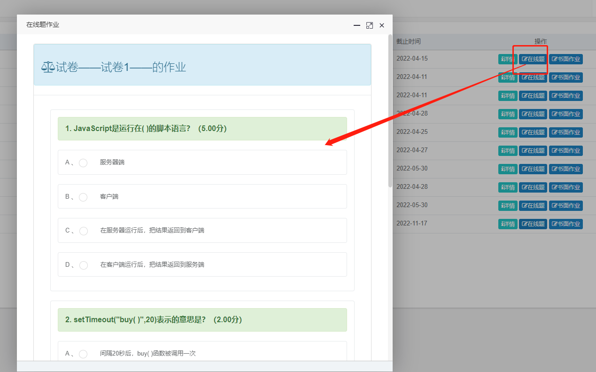
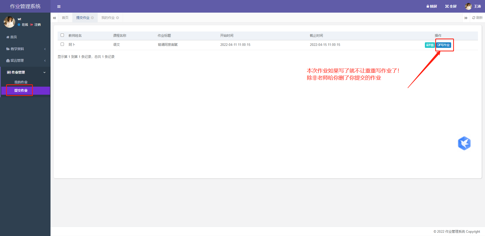

## 学生作业管理系统
本系统使用现在最火的java快速开发平台开发的一套系统；内容非常简单，如果想要扩展些功能的朋友可以一起完善！
感谢若依框架，

## 开发框架及所需环境
1. 开发框架:
    1.1 SpringBoot(基于若依框架-单体版)

2. 开发环境：
   2.1 安装JDK
   2.2 安装MySQL5.7（5.7以下不行）
   2.3 安装Maven
   2.4 安装IDEA

## 项目体验
#### 欢迎请作者喝咖啡，或者续费服务器用！！！
#### 体验地址;[https://h.rasmall.cn/](https://h.rasmall.cn/)
#### 请不要修改密码哦，否则影响小伙伴们的体验
1. 超级管理员>账号：padmin 密码:123456
2. 老师1>账号:abu 密码：123456
3. 老师2>账号:abu100 密码：123456
4. A班学生>账号:wt 密码：123456
5. B班学生>账号:lf 密码：123456
#### 联系方式：QQ932696181

## 一、系统主要功能
1. _**系统管理：**_ 超级管理有全部数据权限，教师只有2,3,4,5功能管理
2. _**教学资料：**_ 教师、管理员上传教学资料，学生只能下载
3. _**留言管理：**_ 学生只能留言和查看，教师、管理员对留言信息管理
4. _**作业管理：**_ 教师发布作业，批阅作业，学生提交与查看作业
5. _**题库管理：**_ 教师、管理员都可以添加自己的题库，学生只能查看，并做题

## 二、系统角色
_**1. 超级管理员**_
_**2. 教师角色**_
_**3. 学生角色**_

## 三、功能测试账号密码
1. 超级管理员>账号：padmin 密码:123456
2. 老师1>账号:abu 密码：123456
3. 老师2>账号:abu100 密码：123456
4. A班学生>账号:wt 密码：123456
5. B班学生>账号:lf 密码：123456

## 系统管理
**_1. 用户管理_**
**_2. 班级管理_**
**_3. 通知公告_**

## 教学资料
1. 只有老师和管理员有权限发布，其余学生只能下载

## 留言管理
1. 老师，管理员，学生都能留言
2. 学生只能留言和查看留言，不能修改和删除
3. 只有老师和管理员才能删除和修改留言

## 作业管理
### 教师端
1. 教师发布作业（哪个老师发布的作业就哪个老师看得见）
2. 教师批阅作业（只能批阅自己班级的作业）
3. 老师统计作业的提交情况
4. 老师导出作业数据
### 学生端
1. 我的作业（自己做的所有作业，查看和修改；已批阅不能修改）
2. 提交作业（只能做自己老师发布的作业，已过期不能写作业，已完成作业不能重复写作业）

## 题库管理
### 教师端
1. 教师添加题库：添加自己的题库，留作业时可以选择

2. 老师统计作业数据

3. 老师导出作业分数等数据

4. 选题库留作业：主要以客观题，单选题多选题、判断题等等

5. 学生提交作业时系统自动判客观题，单选多选等，给主管题的分数就本次作业结束

### 学生端
1. 学生写作业时可以在线做客观题，选择题，判断题等等
   
## 演示图
### 超级管理员登录
#### 1. 修改自己的信息

#### 2. 用户管理

#### 3. 班级管理

#### 4. 通知公告管理

## 教师登录

#### 1. 修改自己的信息

#### 2. 可以查看首页的通知公告

#### 3. 通知公告管理

#### 4. 发布作业

#### 5. 编辑发布的作业
如果过期了，学生做不了了就可以改下结束时间即可

#### 6. 批阅作业（主观题和客观题：客观题会自动被系统判）

#### 7. 留言管理

#### 8. 教学资料管理

## 学生登录
#### 1. 修改自己的信息

#### 2. 可以查看首页的通知公告

#### 3. 留言

#### 4. 教学资料

#### 5. 提交作业
##### 学生查看老师留的作业信息

学生写作业（作业没有过期可以继续写作业的，如果做完就不可再做了，除非老师给你删除了你提交的作业）

#### 6. 我的作业
学生查看自己写的作业信息，老师批阅时的信息等等

学生修改作业（老师没有批阅期间是可以修改作业的）

# Demo
